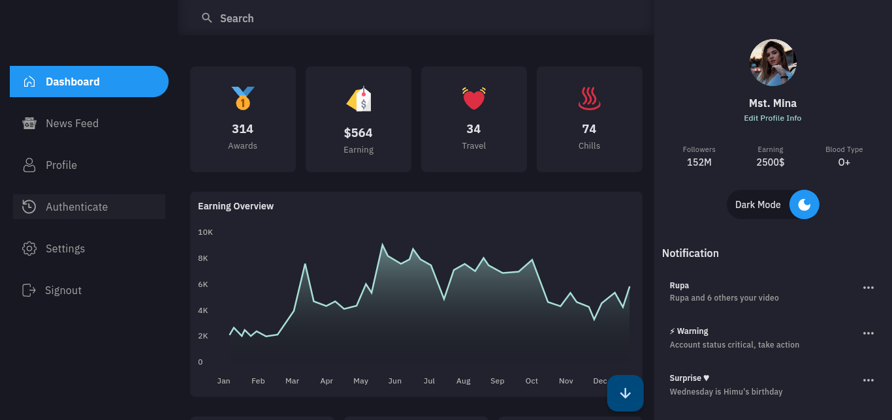

# Flutter Responsive Dashboard

This is a responsive Flutter admin dashboard project that allows you to manage your application data and settings in a user-friendly way.

## Getting Started

1. Clone the repository:

```
git clone https://github.com/arrahmanbd/responsive_flutter_dashboard.git
```

2. Open the project in your preferred IDE, such as Android Studio or Visual Studio Code.

3. Install the required dependencies:

```
flutter pub get
```
4. Run the project:

## Features

The admin dashboard includes the following features:

- **Responsive Design:** The dashboard is designed to be responsive, so it can be used on a variety of devices, from desktops to mobile phones.

- **Total 5 Page Design:** The responsive dashboard is designed with extra pages, so it can be used in your variety projects.

- **User Authentication:** The dashboard includes a user authentication ui, so only authorized users can access the dashboard.

- **Dashboard Widgets:** The dashboard includes a variety of widgets to display data and provide quick access to frequently used features.

- **Settings Management:** The dashboard allows you to manage your application settings, including changing your account password and updating your profile information.
## Screenshot




## Contributing

Contributions are welcome! If you find a bug or have a feature request, please open an issue or submit a pull request.

## 🔗 Follow
[](https://arrahmanbd.github.io/)
[](https://www.linkedin.com/in/arrahmanbd)
[](https://www.github.com/arrahmanbd)

## License

This project is licensed under the MIT License - see the [LICENSE](LICENSE) file for details.